# Warehouse ERD — the project document as relational tables

> Generated by `npm run data-dictionary` ([`scripts/gen-warehouse-erd.js`](https://github.com/DEFRA/bng-metric-backend/blob/main/scripts/gen-warehouse-erd.js)).
> Do not edit by hand — change the Joi schema in
> [`src/validation/project.js`](https://github.com/DEFRA/bng-metric-backend/blob/main/src/validation/project.js) or the table layout in
> [`scripts/warehouse-erd.js`](https://github.com/DEFRA/bng-metric-backend/blob/main/scripts/warehouse-erd.js) and regenerate.

We send the whole BNG project document as JSON; the receiving system maps
it into relational rows and upserts them. This page is the contract for
that mapping: the tables the document decomposes into, the key for each,
and what those keys guarantee.

Column-level detail — descriptions, constraints, nullability — lives in the [`data dictionary`](https://github.com/DEFRA/bng-metric-backend/blob/main/data-dictionary/data-dictionary.md). This page covers structure and identity.

**21 tables**, mapping 334 schema fields.

## Diagram

```mermaid
erDiagram
    project ||--o| project_site : "has"
    project ||--o| project_units : "has"
    project ||--o| project_details : "has"
    project ||--o{ feature_set : "contains"
    feature_set ||--o| feature_set_units : "has"
    feature_set ||--o| feature_set_habitat_sizes : "has"
    feature_set ||--o| feature_set_trading_rules : "has"
    feature_set_trading_rules ||--o{ feature_set_trading_rules_area_habitat_types : "contains"
    feature_set_trading_rules ||--o{ feature_set_trading_rules_area_broad_habitats : "contains"
    feature_set_trading_rules ||--o{ feature_set_trading_rules_watercourse_habitats : "contains"
    feature_set ||--o| baseline_red_line : "has"
    feature_set ||--o{ baseline_habitats : "contains"
    feature_set ||--o{ baseline_trees : "contains"
    feature_set ||--o{ baseline_hedgerows : "contains"
    feature_set ||--o{ baseline_watercourses : "contains"
    feature_set ||--o| post_intervention_red_line : "has"
    feature_set ||--o{ post_intervention_habitats : "contains"
    feature_set ||--o{ post_intervention_trees : "contains"
    feature_set ||--o{ post_intervention_hedgerows : "contains"
    feature_set ||--o{ post_intervention_watercourses : "contains"

    project {
        uuid project_id PK "bng.projects.id — the existing Postgres UUID, reused as-is"
        text name
    }
    project_site {
        text site_id PK "{projectId}:site"
        uuid project_id FK "→ project.project_id"
        text name
        text grid_ref
    }
    project_units {
        text units_id PK "{projectId}:units"
        uuid project_id FK "→ project.project_id"
        numeric habitat
        numeric hedgerow
        numeric watercourse
    }
    project_details {
        text details_id PK "{projectId}:details"
        uuid project_id FK "→ project.project_id"
        text local_planning_authority
        text development_type
    }
    feature_set {
        text feature_set_id PK "{projectId}:{documentKey}"
        uuid project_id FK "→ project.project_id"
        text document_key "'baseline' or 'postIntervention' — which subtree the row came from"
        uuid upload_id
        text filename
        timestamptz imported_at
    }
    feature_set_units {
        text feature_set_units_id PK "{projectId}:{documentKey}:units"
        text feature_set_id FK "→ feature_set.feature_set_id"
        numeric total_units
        numeric habitats_total
    }
    feature_set_habitat_sizes {
        text habitat_sizes_id PK "{projectId}:{documentKey}:habitatSizes"
        text feature_set_id FK "→ feature_set.feature_set_id"
        numeric area_habitats_total_square_metres
        numeric site_total_square_metres
    }
    feature_set_trading_rules {
        text trading_rules_id PK "{projectId}:postIntervention:tradingRules"
        text feature_set_id FK "→ feature_set.feature_set_id"
        numeric area_habitats_medium_surplus
        numeric area_habitats_low_cumulative_availability
        numeric watercourses_medium_surplus
        numeric watercourses_low_cumulative_availability
    }
    feature_set_trading_rules_area_habitat_types {
        text trading_rules_area_habitat_type_id PK "{projectId}:postIntervention:tradingRules:areaHabitats:{habitatType}"
        text trading_rules_id FK "→ feature_set_trading_rules.trading_rules_id"
        text habitat_type
        text broad_habitat
        numeric net_unit_change
    }
    feature_set_trading_rules_area_broad_habitats {
        text trading_rules_area_broad_habitat_id PK "{projectId}:postIntervention:tradingRules:areaHabitats:medium:{broadHabitat}"
        text trading_rules_id FK "→ feature_set_trading_rules.trading_rules_id"
        text broad_habitat
        numeric net_unit_change
    }
    feature_set_trading_rules_watercourse_habitats {
        text trading_rules_watercourse_habitat_id PK "{projectId}:postIntervention:tradingRules:watercourses:{habitatType}"
        text trading_rules_id FK "→ feature_set_trading_rules.trading_rules_id"
        text habitat_type
        text distinctiveness
        numeric net_unit_change
    }
    baseline_red_line {
        uuid feature_id PK "the feature's own featureId — also the PK of the matching PostGIS geometry row"
        text feature_set_id FK "→ feature_set.feature_set_id"
        text site_name
        numeric area
    }
    baseline_habitats {
        uuid feature_id PK "the feature's own featureId — also the PK of the matching PostGIS geometry row"
        text feature_set_id FK "→ feature_set.feature_set_id"
        text ref
        text type
        text status
        numeric units
    }
    baseline_trees {
        uuid feature_id PK "the feature's own featureId — also the PK of the matching PostGIS geometry row"
        text feature_set_id FK "→ feature_set.feature_set_id"
        text status
        text ref
        text type
        numeric units
    }
    baseline_hedgerows {
        uuid feature_id PK "the feature's own featureId — also the PK of the matching PostGIS geometry row"
        text feature_set_id FK "→ feature_set.feature_set_id"
        text ref
        text type
        text status
        numeric units
    }
    baseline_watercourses {
        uuid feature_id PK "the feature's own featureId — also the PK of the matching PostGIS geometry row"
        text feature_set_id FK "→ feature_set.feature_set_id"
        text ref
        text type
        text status
        numeric units
    }
    post_intervention_red_line {
        uuid feature_id PK "the feature's own featureId — also the PK of the matching PostGIS geometry row"
        text feature_set_id FK "→ feature_set.feature_set_id"
        text site_name
        numeric area
    }
    post_intervention_habitats {
        uuid feature_id PK "the feature's own featureId — also the PK of the matching PostGIS geometry row"
        text feature_set_id FK "→ feature_set.feature_set_id"
        text ref
        numeric units
        text status
    }
    post_intervention_trees {
        uuid feature_id PK "the feature's own featureId — also the PK of the matching PostGIS geometry row"
        text feature_set_id FK "→ feature_set.feature_set_id"
        text ref
        numeric units
        text status
    }
    post_intervention_hedgerows {
        uuid feature_id PK "the feature's own featureId — also the PK of the matching PostGIS geometry row"
        text feature_set_id FK "→ feature_set.feature_set_id"
        text ref
        numeric units
        text status
    }
    post_intervention_watercourses {
        uuid feature_id PK "the feature's own featureId — also the PK of the matching PostGIS geometry row"
        text feature_set_id FK "→ feature_set.feature_set_id"
        text ref
        numeric units
        text status
    }
```

## Key derivation

Only two kinds of key exist in this contract.

**Stored UUIDs.** `projectId` is `bng.projects.id`, the row's existing
Postgres primary key. `featureId` is the UUID stamped onto each feature at
import, which is also the primary key of the matching PostGIS geometry row
(`bng.baseline_habitats.id` and friends). Both are stable — see
"Stability guarantees" below.

**Derived keys.** Every other object in the document is exactly one per
parent, so it needs no surrogate of its own: its key is composed from the
ids above. Nothing is stored for these; compose them on read.

| Table                                            | Primary key                            | Derivation                                                                       |
| ------------------------------------------------ | -------------------------------------- | -------------------------------------------------------------------------------- |
| `project`                                        | `project_id`                           | bng.projects.id — the existing Postgres UUID, reused as-is                       |
| `project_site`                                   | `site_id`                              | `{projectId}:site`                                                               |
| `project_units`                                  | `units_id`                             | `{projectId}:units`                                                              |
| `project_details`                                | `details_id`                           | `{projectId}:details`                                                            |
| `feature_set`                                    | `feature_set_id`                       | `{projectId}:{documentKey}`                                                      |
| `feature_set_units`                              | `feature_set_units_id`                 | `{projectId}:{documentKey}:units`                                                |
| `feature_set_habitat_sizes`                      | `habitat_sizes_id`                     | `{projectId}:{documentKey}:habitatSizes`                                         |
| `feature_set_trading_rules`                      | `trading_rules_id`                     | `{projectId}:postIntervention:tradingRules`                                      |
| `feature_set_trading_rules_area_habitat_types`   | `trading_rules_area_habitat_type_id`   | `{projectId}:postIntervention:tradingRules:areaHabitats:{habitatType}`           |
| `feature_set_trading_rules_area_broad_habitats`  | `trading_rules_area_broad_habitat_id`  | `{projectId}:postIntervention:tradingRules:areaHabitats:medium:{broadHabitat}`   |
| `feature_set_trading_rules_watercourse_habitats` | `trading_rules_watercourse_habitat_id` | `{projectId}:postIntervention:tradingRules:watercourses:{habitatType}`           |
| `baseline_red_line`                              | `feature_id`                           | the feature's own `featureId` — also the PK of the matching PostGIS geometry row |
| `baseline_habitats`                              | `feature_id`                           | the feature's own `featureId` — also the PK of the matching PostGIS geometry row |
| `baseline_trees`                                 | `feature_id`                           | the feature's own `featureId` — also the PK of the matching PostGIS geometry row |
| `baseline_hedgerows`                             | `feature_id`                           | the feature's own `featureId` — also the PK of the matching PostGIS geometry row |
| `baseline_watercourses`                          | `feature_id`                           | the feature's own `featureId` — also the PK of the matching PostGIS geometry row |
| `post_intervention_red_line`                     | `feature_id`                           | the feature's own `featureId` — also the PK of the matching PostGIS geometry row |
| `post_intervention_habitats`                     | `feature_id`                           | the feature's own `featureId` — also the PK of the matching PostGIS geometry row |
| `post_intervention_trees`                        | `feature_id`                           | the feature's own `featureId` — also the PK of the matching PostGIS geometry row |
| `post_intervention_hedgerows`                    | `feature_id`                           | the feature's own `featureId` — also the PK of the matching PostGIS geometry row |
| `post_intervention_watercourses`                 | `feature_id`                           | the feature's own `featureId` — also the PK of the matching PostGIS geometry row |

## Stability guarantees

- **`projectId` never changes.** It is the Postgres primary key, assigned
  at creation.
- **`featureId` survives edits.** Editing a habitat, hedgerow or watercourse
  patches the feature in place; the id is untouched.
- **`featureId` survives a re-upload where the `ref` is unchanged.** When a
  user uploads a corrected GeoPackage over a document they already
  imported, ids are carried forward by matching `ref` within each layer, so
  a corrected file produces `UPDATE`s rather than a mass delete-and-insert.
  See [`src/validation/geopackage/carry-forward-feature-ids.js`](https://github.com/DEFRA/bng-metric-backend/blob/main/src/validation/geopackage/carry-forward-feature-ids.js).
- **A `featureId` is regenerated** when the feature is new, when its `ref`
  is blank, or when its `ref` is ambiguous (carried by more than one
  feature on either side). Matching is deliberately conservative: `ref`
  uniqueness is only _enforced_ on the habitats layer, so the other layers
  can legitimately arrive with repeats.

`ref` is therefore the natural key worth surfacing in any report — it is
what a surveyor recognises, and it is what the id follows.

## Update semantics

- The payload is a **full snapshot**. Within a given
  `(project_id, document_key)` scope it is authoritative: rows absent from
  the payload have been deleted.
- **`updated_at`** (`bng.projects.updated_at`, maintained by a BEFORE UPDATE
  trigger) is the row watermark. Use it to order deliveries and discard
  stale ones.
- **`bng_project_version` is not a revision counter.** It is a static `1`,
  never incremented by the application. Do not use it for concurrency
  control.
- Re-uploading a GeoPackage replaces the whole `baseline` or
  `postIntervention` subtree, so treat an import as a full refresh of that
  document scope — not a partial merge.

## Modelling notes

- **Baseline and post-intervention features are separate tables**, not one
  table with a discriminator. Post-intervention features carry nested
  `baseline` / `proposed` blocks that baseline features do not, so a union
  would be mostly null. Those nested blocks are flattened into the parent
  row with `baseline_` / `proposed_` column prefixes — they are strictly one
  per feature and need no key of their own.
- **`feature_set`, `feature_set_units` and `feature_set_habitat_sizes` are
  shared** between the two documents and discriminated by `document_key`.
  Their column sets are identical across both, so a union is exact.
- **The five `habitatSizes` sub-groups are flattened** into one row rather
  than spawning five near-empty tables.
- **`properties` stays a single `jsonb` column.** These are the verbatim
  GeoPackage attribute columns; their keys are arbitrary and vary by source
  file, so normalising them is not useful.
- Feature rows join 1:1 to our PostGIS geometry tables on `feature_id`, so
  geometry can be added later without re-keying anything.

## Tables

### `project`

One row per BNG project. 1 column(s) mapped from the JSON document.

| Column            | Type          | Key | JSON path | Notes                                                               |
| ----------------- | ------------- | --- | --------- | ------------------------------------------------------------------- |
| `project_id`      | `uuid`        | PK  | —         | bng.projects.id — the existing Postgres UUID, reused as-is          |
| `user_id`         | `text`        |     | —         | bng.projects.user_id                                                |
| `org_id`          | `text`        |     | —         | bng.projects.org_id                                                 |
| `relationship_id` | `text`        |     | —         | bng.projects.relationship_id                                        |
| `created_at`      | `timestamptz` |     | —         | bng.projects.created_at                                             |
| `updated_at`      | `timestamptz` |     | —         | bng.projects.updated_at — the row watermark for ordering deliveries |
| `name`            | `text`        |     | `name`    |                                                                     |

### `project_site`

Development site details. Exactly one per project. 2 column(s) mapped from the JSON document.

| Column       | Type   | Key | JSON path       | Notes                |
| ------------ | ------ | --- | --------------- | -------------------- |
| `site_id`    | `text` | PK  | —               | `{projectId}:site`   |
| `project_id` | `uuid` | FK  | —               | → project.project_id |
| `name`       | `text` |     | `site.name`     |                      |
| `grid_ref`   | `text` |     | `site.grid_ref` |                      |

### `project_units`

Project-level biodiversity unit summary. Exactly one per project. 3 column(s) mapped from the JSON document.

| Column        | Type      | Key | JSON path           | Notes                |
| ------------- | --------- | --- | ------------------- | -------------------- |
| `units_id`    | `text`    | PK  | —                   | `{projectId}:units`  |
| `project_id`  | `uuid`    | FK  | —                   | → project.project_id |
| `habitat`     | `numeric` |     | `units.habitat`     |                      |
| `hedgerow`    | `numeric` |     | `units.hedgerow`    |                      |
| `watercourse` | `numeric` |     | `units.watercourse` |                      |

### `project_details`

Project details entered by the user. Exactly one per project; null until the user fills them in. 6 column(s) mapped from the JSON document.

| Column                     | Type   | Key | JSON path                        | Notes                 |
| -------------------------- | ------ | --- | -------------------------------- | --------------------- |
| `details_id`               | `text` | PK  | —                                | `{projectId}:details` |
| `project_id`               | `uuid` | FK  | —                                | → project.project_id  |
| `local_planning_authority` | `text` |     | `details.localPlanningAuthority` |                       |
| `survey_completers`        | `text` |     | `details.surveyCompleters`       |                       |
| `survey_completion_date`   | `text` |     | `details.surveyCompletionDate`   |                       |
| `development_type`         | `text` |     | `details.developmentType`        |                       |
| `nsips`                    | `text` |     | `details.nsips`                  |                       |
| `applicant`                | `text` |     | `details.applicant`              |                       |

### `feature_set`

One row per imported document per project: the GeoPackage upload that produced it. 4 column(s) mapped from the JSON document.

| Column           | Type          | Key | JSON path                                              | Notes                                                              |
| ---------------- | ------------- | --- | ------------------------------------------------------ | ------------------------------------------------------------------ |
| `feature_set_id` | `text`        | PK  | —                                                      | `{projectId}:{documentKey}`                                        |
| `project_id`     | `uuid`        | FK  | —                                                      | → project.project_id                                               |
| `document_key`   | `text`        |     | —                                                      | 'baseline' or 'postIntervention' — which subtree the row came from |
| `upload_id`      | `uuid`        |     | `baseline.uploadId` `postIntervention.uploadId`     |                                                                    |
| `filename`       | `text`        |     | `baseline.filename` `postIntervention.filename`     |                                                                    |
| `file_size`      | `integer`     |     | `baseline.fileSize` `postIntervention.fileSize`     |                                                                    |
| `imported_at`    | `timestamptz` |     | `baseline.importedAt` `postIntervention.importedAt` |                                                                    |

### `feature_set_units`

Biodiversity unit totals for one document, summed across its features. 13 column(s) mapped from the JSON document.

| Column                                    | Type      | Key | JSON path                                                                                                            | Notes                             |
| ----------------------------------------- | --------- | --- | -------------------------------------------------------------------------------------------------------------------- | --------------------------------- |
| `feature_set_units_id`                    | `text`    | PK  | —                                                                                                                    | `{projectId}:{documentKey}:units` |
| `feature_set_id`                          | `text`    | FK  | —                                                                                                                    | → feature_set.feature_set_id      |
| `total_units`                             | `numeric` |     | `baseline.units.totalUnits` `postIntervention.units.totalUnits`                                                   |                                   |
| `habitats_total`                          | `numeric` |     | `baseline.units.habitatsTotal` `postIntervention.units.habitatsTotal`                                             |                                   |
| `hedgerows_total`                         | `numeric` |     | `baseline.units.hedgerowsTotal` `postIntervention.units.hedgerowsTotal`                                           |                                   |
| `watercourses_total`                      | `numeric` |     | `baseline.units.watercoursesTotal` `postIntervention.units.watercoursesTotal`                                     |                                   |
| `trees_total`                             | `numeric` |     | `baseline.units.treesTotal` `postIntervention.units.treesTotal`                                                   |                                   |
| `trees_urban_total`                       | `numeric` |     | `baseline.units.treesUrbanTotal` `postIntervention.units.treesUrbanTotal`                                         |                                   |
| `trees_rural_total`                       | `numeric` |     | `baseline.units.treesRuralTotal` `postIntervention.units.treesRuralTotal`                                         |                                   |
| `habitats_net_unit_change`                | `numeric` |     | `baseline.units.habitatsNetUnitChange` `postIntervention.units.habitatsNetUnitChange`                             |                                   |
| `habitats_net_unit_change_percentage`     | `numeric` |     | `baseline.units.habitatsNetUnitChangePercentage` `postIntervention.units.habitatsNetUnitChangePercentage`         |                                   |
| `hedgerows_net_unit_change`               | `numeric` |     | `baseline.units.hedgerowsNetUnitChange` `postIntervention.units.hedgerowsNetUnitChange`                           |                                   |
| `hedgerows_net_unit_change_percentage`    | `numeric` |     | `baseline.units.hedgerowsNetUnitChangePercentage` `postIntervention.units.hedgerowsNetUnitChangePercentage`       |                                   |
| `watercourses_net_unit_change`            | `numeric` |     | `baseline.units.watercoursesNetUnitChange` `postIntervention.units.watercoursesNetUnitChange`                     |                                   |
| `watercourses_net_unit_change_percentage` | `numeric` |     | `baseline.units.watercoursesNetUnitChangePercentage` `postIntervention.units.watercoursesNetUnitChangePercentage` |                                   |

### `feature_set_habitat_sizes`

Total feature sizes by module, measured from geometry in PostGIS. The five sub-groups in the JSON are flattened into one row. 7 column(s) mapped from the JSON document.

| Column                              | Type      | Key | JSON path                                                                                                                | Notes                                    |
| ----------------------------------- | --------- | --- | ------------------------------------------------------------------------------------------------------------------------ | ---------------------------------------- |
| `habitat_sizes_id`                  | `text`    | PK  | —                                                                                                                        | `{projectId}:{documentKey}:habitatSizes` |
| `feature_set_id`                    | `text`    | FK  | —                                                                                                                        | → feature_set.feature_set_id             |
| `area_habitats_total_square_metres` | `numeric` |     | `baseline.habitatSizes.areaHabitats.totalSquareMetres` `postIntervention.habitatSizes.areaHabitats.totalSquareMetres` |                                          |
| `hedgerows_total_metres`            | `numeric` |     | `baseline.habitatSizes.hedgerows.totalMetres` `postIntervention.habitatSizes.hedgerows.totalMetres`                   |                                          |
| `watercourses_total_metres`         | `numeric` |     | `baseline.habitatSizes.watercourses.totalMetres` `postIntervention.habitatSizes.watercourses.totalMetres`             |                                          |
| `trees_total_square_metres`         | `numeric` |     | `baseline.habitatSizes.trees.totalSquareMetres` `postIntervention.habitatSizes.trees.totalSquareMetres`               |                                          |
| `trees_urban_square_metres`         | `numeric` |     | `baseline.habitatSizes.trees.urbanSquareMetres` `postIntervention.habitatSizes.trees.urbanSquareMetres`               |                                          |
| `trees_rural_square_metres`         | `numeric` |     | `baseline.habitatSizes.trees.ruralSquareMetres` `postIntervention.habitatSizes.trees.ruralSquareMetres`               |                                          |
| `site_total_square_metres`          | `numeric` |     | `baseline.habitatSizes.site.totalSquareMetres` `postIntervention.habitatSizes.site.totalSquareMetres`                 |                                          |

### `feature_set_trading_rules`

Trading-rules unit figures for the post-intervention document (area habitats and watercourses today; hedgerows follow). Absent on the baseline feature set. 8 column(s) mapped from the JSON document.

| Column                                      | Type      | Key | JSON path                                                               | Notes                                       |
| ------------------------------------------- | --------- | --- | ----------------------------------------------------------------------- | ------------------------------------------- |
| `trading_rules_id`                          | `text`    | PK  | —                                                                       | `{projectId}:postIntervention:tradingRules` |
| `feature_set_id`                            | `text`    | FK  | —                                                                       | → feature_set.feature_set_id                |
| `area_habitats_medium_surplus`              | `numeric` |     | `postIntervention.tradingRules.areaHabitats.medium.surplus`             |                                             |
| `area_habitats_medium_deficit`              | `numeric` |     | `postIntervention.tradingRules.areaHabitats.medium.deficit`             |                                             |
| `area_habitats_low_net_unit_change`         | `numeric` |     | `postIntervention.tradingRules.areaHabitats.low.netUnitChange`          |                                             |
| `area_habitats_low_cumulative_availability` | `numeric` |     | `postIntervention.tradingRules.areaHabitats.low.cumulativeAvailability` |                                             |
| `watercourses_medium_surplus`               | `numeric` |     | `postIntervention.tradingRules.watercourses.medium.surplus`             |                                             |
| `watercourses_medium_deficit`               | `numeric` |     | `postIntervention.tradingRules.watercourses.medium.deficit`             |                                             |
| `watercourses_low_net_unit_change`          | `numeric` |     | `postIntervention.tradingRules.watercourses.low.netUnitChange`          |                                             |
| `watercourses_low_cumulative_availability`  | `numeric` |     | `postIntervention.tradingRules.watercourses.low.cumulativeAvailability` |                                             |

### `feature_set_trading_rules_area_habitat_types`

Area-habitat net unit change per habitat type. One row per unique Medium or Low habitat TYPE — not per feature: the units of every parcel and tree of a type are summed before this row is written. Individual trees are included. 5 column(s) mapped from the JSON document.

| Column                               | Type      | Key | JSON path                                                                       | Notes                                                                  |
| ------------------------------------ | --------- | --- | ------------------------------------------------------------------------------- | ---------------------------------------------------------------------- |
| `trading_rules_area_habitat_type_id` | `text`    | PK  | —                                                                               | `{projectId}:postIntervention:tradingRules:areaHabitats:{habitatType}` |
| `trading_rules_id`                   | `text`    | FK  | —                                                                               | → feature_set_trading_rules.trading_rules_id                           |
| `habitat_type`                       | `text`    |     | `postIntervention.tradingRules.areaHabitats.habitatTypes[].habitatType`         |                                                                        |
| `broad_habitat`                      | `text`    |     | `postIntervention.tradingRules.areaHabitats.habitatTypes[].broadHabitat`        |                                                                        |
| `trading_broad_habitat`              | `text`    |     | `postIntervention.tradingRules.areaHabitats.habitatTypes[].tradingBroadHabitat` |                                                                        |
| `distinctiveness`                    | `text`    |     | `postIntervention.tradingRules.areaHabitats.habitatTypes[].distinctiveness`     |                                                                        |
| `net_unit_change`                    | `numeric` |     | `postIntervention.tradingRules.areaHabitats.habitatTypes[].netUnitChange`       |                                                                        |

### `feature_set_trading_rules_area_broad_habitats`

Cumulative Medium-band net unit change per broad habitat, with intertidal sediment and intertidal hard structures merged into one row: the trading rules treat those two as one broad habitat. 2 column(s) mapped from the JSON document.

| Column                                | Type      | Key | JSON path                                                                         | Notes                                                                          |
| ------------------------------------- | --------- | --- | --------------------------------------------------------------------------------- | ------------------------------------------------------------------------------ |
| `trading_rules_area_broad_habitat_id` | `text`    | PK  | —                                                                                 | `{projectId}:postIntervention:tradingRules:areaHabitats:medium:{broadHabitat}` |
| `trading_rules_id`                    | `text`    | FK  | —                                                                                 | → feature_set_trading_rules.trading_rules_id                                   |
| `broad_habitat`                       | `text`    |     | `postIntervention.tradingRules.areaHabitats.medium.broadHabitats[].broadHabitat`  |                                                                                |
| `net_unit_change`                     | `numeric` |     | `postIntervention.tradingRules.areaHabitats.medium.broadHabitats[].netUnitChange` |                                                                                |

### `feature_set_trading_rules_watercourse_habitats`

Per-habitat-type watercourse net unit change (BMD-995 AC1). One row per unique watercourse type. 3 column(s) mapped from the JSON document.

| Column                                 | Type      | Key | JSON path                                                               | Notes                                                                  |
| -------------------------------------- | --------- | --- | ----------------------------------------------------------------------- | ---------------------------------------------------------------------- |
| `trading_rules_watercourse_habitat_id` | `text`    | PK  | —                                                                       | `{projectId}:postIntervention:tradingRules:watercourses:{habitatType}` |
| `trading_rules_id`                     | `text`    | FK  | —                                                                       | → feature_set_trading_rules.trading_rules_id                           |
| `habitat_type`                         | `text`    |     | `postIntervention.tradingRules.watercourses.habitats[].habitatType`     |                                                                        |
| `distinctiveness`                      | `text`    |     | `postIntervention.tradingRules.watercourses.habitats[].distinctiveness` |                                                                        |
| `net_unit_change`                      | `numeric` |     | `postIntervention.tradingRules.watercourses.habitats[].netUnitChange`   |                                                                        |

### `baseline_red_line`

Red Line Boundary defining the site extent (baseline). At most one per document. 3 column(s) mapped from the JSON document.

| Column           | Type      | Key | JSON path                     | Notes                                                                            |
| ---------------- | --------- | --- | ----------------------------- | -------------------------------------------------------------------------------- |
| `feature_id`     | `uuid`    | PK  | —                             | the feature's own `featureId` — also the PK of the matching PostGIS geometry row |
| `feature_set_id` | `text`    | FK  | —                             | → feature_set.feature_set_id                                                     |
| `site_name`      | `text`    |     | `baseline.redLine.siteName`   |                                                                                  |
| `area`           | `numeric` |     | `baseline.redLine.area`       |                                                                                  |
| `properties`     | `jsonb`   |     | `baseline.redLine.properties` | verbatim GeoPackage attribute columns                                            |

### `baseline_habitats`

habitats in the baseline document. 26 column(s) mapped from the JSON document.

| Column                                     | Type      | Key | JSON path                                                 | Notes                                                                            |
| ------------------------------------------ | --------- | --- | --------------------------------------------------------- | -------------------------------------------------------------------------------- |
| `feature_id`                               | `uuid`    | PK  | —                                                         | the feature's own `featureId` — also the PK of the matching PostGIS geometry row |
| `feature_set_id`                           | `text`    | FK  | —                                                         | → feature_set.feature_set_id                                                     |
| `ref`                                      | `text`    |     | `baseline.habitats[].ref`                                 |                                                                                  |
| `type`                                     | `text`    |     | `baseline.habitats[].type`                                |                                                                                  |
| `broad_type`                               | `text`    |     | `baseline.habitats[].broadType`                           |                                                                                  |
| `distinctiveness`                          | `text`    |     | `baseline.habitats[].distinctiveness`                     |                                                                                  |
| `distinctiveness_score`                    | `numeric` |     | `baseline.habitats[].distinctivenessScore`                |                                                                                  |
| `condition`                                | `text`    |     | `baseline.habitats[].condition`                           |                                                                                  |
| `condition_score`                          | `numeric` |     | `baseline.habitats[].conditionScore`                      |                                                                                  |
| `strategic_significance`                   | `text`    |     | `baseline.habitats[].strategicSignificance`               |                                                                                  |
| `retention_category`                       | `text`    |     | `baseline.habitats[].retentionCategory`                   |                                                                                  |
| `area`                                     | `numeric` |     | `baseline.habitats[].area`                                |                                                                                  |
| `size_square_metres`                       | `numeric` |     | `baseline.habitats[].sizeSquareMetres`                    |                                                                                  |
| `status`                                   | `text`    |     | `baseline.habitats[].status`                              |                                                                                  |
| `units`                                    | `numeric` |     | `baseline.habitats[].units`                               |                                                                                  |
| `site_name`                                | `text`    |     | `baseline.habitats[].siteName`                            |                                                                                  |
| `survey_date`                              | `text`    |     | `baseline.habitats[].surveyDate`                          |                                                                                  |
| `survey_details`                           | `text`    |     | `baseline.habitats[].surveyDetails`                       |                                                                                  |
| `comment`                                  | `text`    |     | `baseline.habitats[].comment`                             |                                                                                  |
| `mapped_by`                                | `text`    |     | `baseline.habitats[].mappedBy`                            |                                                                                  |
| `company`                                  | `text`    |     | `baseline.habitats[].company`                             |                                                                                  |
| `base_map`                                 | `text`    |     | `baseline.habitats[].baseMap`                             |                                                                                  |
| `location`                                 | `text`    |     | `baseline.habitats[].location`                            |                                                                                  |
| `spatial_risk_category`                    | `text`    |     | `baseline.habitats[].spatialRiskCategory`                 |                                                                                  |
| `habitat_created_in_advance_years`         | `text`    |     | `baseline.habitats[].habitatCreatedInAdvanceYears`        |                                                                                  |
| `delay_in_starting_habitat_creation_years` | `text`    |     | `baseline.habitats[].delayInStartingHabitatCreationYears` |                                                                                  |
| `raw_distinctiveness`                      | `text`    |     | `baseline.habitats[].rawDistinctiveness`                  |                                                                                  |
| `properties`                               | `jsonb`   |     | `baseline.habitats[].properties`                          | verbatim GeoPackage attribute columns                                            |

### `baseline_trees`

trees in the baseline document. 30 column(s) mapped from the JSON document.

| Column                                     | Type      | Key | JSON path                                              | Notes                                                                            |
| ------------------------------------------ | --------- | --- | ------------------------------------------------------ | -------------------------------------------------------------------------------- |
| `feature_id`                               | `uuid`    | PK  | —                                                      | the feature's own `featureId` — also the PK of the matching PostGIS geometry row |
| `feature_set_id`                           | `text`    | FK  | —                                                      | → feature_set.feature_set_id                                                     |
| `distinctiveness_score`                    | `numeric` |     | `baseline.trees[].distinctivenessScore`                |                                                                                  |
| `condition`                                | `text`    |     | `baseline.trees[].condition`                           |                                                                                  |
| `condition_score`                          | `numeric` |     | `baseline.trees[].conditionScore`                      |                                                                                  |
| `strategic_significance`                   | `text`    |     | `baseline.trees[].strategicSignificance`               |                                                                                  |
| `retention_category`                       | `text`    |     | `baseline.trees[].retentionCategory`                   |                                                                                  |
| `status`                                   | `text`    |     | `baseline.trees[].status`                              |                                                                                  |
| `site_name`                                | `text`    |     | `baseline.trees[].siteName`                            |                                                                                  |
| `survey_date`                              | `text`    |     | `baseline.trees[].surveyDate`                          |                                                                                  |
| `survey_details`                           | `text`    |     | `baseline.trees[].surveyDetails`                       |                                                                                  |
| `comment`                                  | `text`    |     | `baseline.trees[].comment`                             |                                                                                  |
| `mapped_by`                                | `text`    |     | `baseline.trees[].mappedBy`                            |                                                                                  |
| `company`                                  | `text`    |     | `baseline.trees[].company`                             |                                                                                  |
| `base_map`                                 | `text`    |     | `baseline.trees[].baseMap`                             |                                                                                  |
| `location`                                 | `text`    |     | `baseline.trees[].location`                            |                                                                                  |
| `spatial_risk_category`                    | `text`    |     | `baseline.trees[].spatialRiskCategory`                 |                                                                                  |
| `habitat_created_in_advance_years`         | `text`    |     | `baseline.trees[].habitatCreatedInAdvanceYears`        |                                                                                  |
| `delay_in_starting_habitat_creation_years` | `text`    |     | `baseline.trees[].delayInStartingHabitatCreationYears` |                                                                                  |
| `raw_distinctiveness`                      | `text`    |     | `baseline.trees[].rawDistinctiveness`                  |                                                                                  |
| `ref`                                      | `text`    |     | `baseline.trees[].ref`                                 |                                                                                  |
| `type`                                     | `text`    |     | `baseline.trees[].type`                                |                                                                                  |
| `broad_type`                               | `text`    |     | `baseline.trees[].broadType`                           |                                                                                  |
| `distinctiveness`                          | `text`    |     | `baseline.trees[].distinctiveness`                     |                                                                                  |
| `area`                                     | `numeric` |     | `baseline.trees[].area`                                |                                                                                  |
| `size_square_metres`                       | `numeric` |     | `baseline.trees[].sizeSquareMetres`                    |                                                                                  |
| `units`                                    | `numeric` |     | `baseline.trees[].units`                               |                                                                                  |
| `properties`                               | `jsonb`   |     | `baseline.trees[].properties`                          | verbatim GeoPackage attribute columns                                            |
| `tree_size`                                | `text`    |     | `baseline.trees[].treeSize`                            |                                                                                  |
| `tree_species`                             | `text`    |     | `baseline.trees[].treeSpecies`                         |                                                                                  |
| `rural_or_urban`                           | `text`    |     | `baseline.trees[].ruralOrUrban`                        |                                                                                  |
| `count`                                    | `numeric` |     | `baseline.trees[].count`                               |                                                                                  |

### `baseline_hedgerows`

hedgerows in the baseline document. 25 column(s) mapped from the JSON document.

| Column                                     | Type      | Key | JSON path                                                  | Notes                                                                            |
| ------------------------------------------ | --------- | --- | ---------------------------------------------------------- | -------------------------------------------------------------------------------- |
| `feature_id`                               | `uuid`    | PK  | —                                                          | the feature's own `featureId` — also the PK of the matching PostGIS geometry row |
| `feature_set_id`                           | `text`    | FK  | —                                                          | → feature_set.feature_set_id                                                     |
| `ref`                                      | `text`    |     | `baseline.hedgerows[].ref`                                 |                                                                                  |
| `type`                                     | `text`    |     | `baseline.hedgerows[].type`                                |                                                                                  |
| `condition`                                | `text`    |     | `baseline.hedgerows[].condition`                           |                                                                                  |
| `distinctiveness`                          | `text`    |     | `baseline.hedgerows[].distinctiveness`                     |                                                                                  |
| `distinctiveness_score`                    | `numeric` |     | `baseline.hedgerows[].distinctivenessScore`                |                                                                                  |
| `condition_score`                          | `numeric` |     | `baseline.hedgerows[].conditionScore`                      |                                                                                  |
| `length`                                   | `numeric` |     | `baseline.hedgerows[].length`                              |                                                                                  |
| `size_metres`                              | `numeric` |     | `baseline.hedgerows[].sizeMetres`                          |                                                                                  |
| `status`                                   | `text`    |     | `baseline.hedgerows[].status`                              |                                                                                  |
| `units`                                    | `numeric` |     | `baseline.hedgerows[].units`                               |                                                                                  |
| `strategic_significance`                   | `text`    |     | `baseline.hedgerows[].strategicSignificance`               |                                                                                  |
| `retention_category`                       | `text`    |     | `baseline.hedgerows[].retentionCategory`                   |                                                                                  |
| `site_name`                                | `text`    |     | `baseline.hedgerows[].siteName`                            |                                                                                  |
| `survey_date`                              | `text`    |     | `baseline.hedgerows[].surveyDate`                          |                                                                                  |
| `survey_details`                           | `text`    |     | `baseline.hedgerows[].surveyDetails`                       |                                                                                  |
| `comment`                                  | `text`    |     | `baseline.hedgerows[].comment`                             |                                                                                  |
| `mapped_by`                                | `text`    |     | `baseline.hedgerows[].mappedBy`                            |                                                                                  |
| `company`                                  | `text`    |     | `baseline.hedgerows[].company`                             |                                                                                  |
| `base_map`                                 | `text`    |     | `baseline.hedgerows[].baseMap`                             |                                                                                  |
| `location`                                 | `text`    |     | `baseline.hedgerows[].location`                            |                                                                                  |
| `spatial_risk_category`                    | `text`    |     | `baseline.hedgerows[].spatialRiskCategory`                 |                                                                                  |
| `habitat_created_in_advance_years`         | `text`    |     | `baseline.hedgerows[].habitatCreatedInAdvanceYears`        |                                                                                  |
| `delay_in_starting_habitat_creation_years` | `text`    |     | `baseline.hedgerows[].delayInStartingHabitatCreationYears` |                                                                                  |
| `raw_distinctiveness`                      | `text`    |     | `baseline.hedgerows[].rawDistinctiveness`                  |                                                                                  |
| `properties`                               | `jsonb`   |     | `baseline.hedgerows[].properties`                          | verbatim GeoPackage attribute columns                                            |

### `baseline_watercourses`

watercourses in the baseline document. 30 column(s) mapped from the JSON document.

| Column                                     | Type      | Key | JSON path                                                     | Notes                                                                            |
| ------------------------------------------ | --------- | --- | ------------------------------------------------------------- | -------------------------------------------------------------------------------- |
| `feature_id`                               | `uuid`    | PK  | —                                                             | the feature's own `featureId` — also the PK of the matching PostGIS geometry row |
| `feature_set_id`                           | `text`    | FK  | —                                                             | → feature_set.feature_set_id                                                     |
| `ref`                                      | `text`    |     | `baseline.watercourses[].ref`                                 |                                                                                  |
| `type`                                     | `text`    |     | `baseline.watercourses[].type`                                |                                                                                  |
| `condition`                                | `text`    |     | `baseline.watercourses[].condition`                           |                                                                                  |
| `riparian_encroachment`                    | `text`    |     | `baseline.watercourses[].riparianEncroachment`                |                                                                                  |
| `watercourse_encroachment`                 | `text`    |     | `baseline.watercourses[].watercourseEncroachment`             |                                                                                  |
| `distinctiveness`                          | `text`    |     | `baseline.watercourses[].distinctiveness`                     |                                                                                  |
| `distinctiveness_score`                    | `numeric` |     | `baseline.watercourses[].distinctivenessScore`                |                                                                                  |
| `condition_score`                          | `numeric` |     | `baseline.watercourses[].conditionScore`                      |                                                                                  |
| `length`                                   | `numeric` |     | `baseline.watercourses[].length`                              |                                                                                  |
| `size_metres`                              | `numeric` |     | `baseline.watercourses[].sizeMetres`                          |                                                                                  |
| `status`                                   | `text`    |     | `baseline.watercourses[].status`                              |                                                                                  |
| `units`                                    | `numeric` |     | `baseline.watercourses[].units`                               |                                                                                  |
| `strategic_significance`                   | `text`    |     | `baseline.watercourses[].strategicSignificance`               |                                                                                  |
| `retention_category`                       | `text`    |     | `baseline.watercourses[].retentionCategory`                   |                                                                                  |
| `site_name`                                | `text`    |     | `baseline.watercourses[].siteName`                            |                                                                                  |
| `survey_date`                              | `text`    |     | `baseline.watercourses[].surveyDate`                          |                                                                                  |
| `survey_details`                           | `text`    |     | `baseline.watercourses[].surveyDetails`                       |                                                                                  |
| `comment`                                  | `text`    |     | `baseline.watercourses[].comment`                             |                                                                                  |
| `mapped_by`                                | `text`    |     | `baseline.watercourses[].mappedBy`                            |                                                                                  |
| `company`                                  | `text`    |     | `baseline.watercourses[].company`                             |                                                                                  |
| `base_map`                                 | `text`    |     | `baseline.watercourses[].baseMap`                             |                                                                                  |
| `location`                                 | `text`    |     | `baseline.watercourses[].location`                            |                                                                                  |
| `spatial_risk_category`                    | `text`    |     | `baseline.watercourses[].spatialRiskCategory`                 |                                                                                  |
| `habitat_created_in_advance_years`         | `text`    |     | `baseline.watercourses[].habitatCreatedInAdvanceYears`        |                                                                                  |
| `delay_in_starting_habitat_creation_years` | `text`    |     | `baseline.watercourses[].delayInStartingHabitatCreationYears` |                                                                                  |
| `raw_distinctiveness`                      | `text`    |     | `baseline.watercourses[].rawDistinctiveness`                  |                                                                                  |
| `enhancement_type`                         | `text`    |     | `baseline.watercourses[].enhancementType`                     |                                                                                  |
| `water_encroachment_multiplier`            | `numeric` |     | `baseline.watercourses[].waterEncroachmentMultiplier`         |                                                                                  |
| `riparian_encroachment_multiplier`         | `numeric` |     | `baseline.watercourses[].riparianEncroachmentMultiplier`      |                                                                                  |
| `properties`                               | `jsonb`   |     | `baseline.watercourses[].properties`                          | verbatim GeoPackage attribute columns                                            |

### `post_intervention_red_line`

Red Line Boundary defining the site extent (postIntervention). At most one per document. 3 column(s) mapped from the JSON document.

| Column           | Type      | Key | JSON path                             | Notes                                                                            |
| ---------------- | --------- | --- | ------------------------------------- | -------------------------------------------------------------------------------- |
| `feature_id`     | `uuid`    | PK  | —                                     | the feature's own `featureId` — also the PK of the matching PostGIS geometry row |
| `feature_set_id` | `text`    | FK  | —                                     | → feature_set.feature_set_id                                                     |
| `site_name`      | `text`    |     | `postIntervention.redLine.siteName`   |                                                                                  |
| `area`           | `numeric` |     | `postIntervention.redLine.area`       |                                                                                  |
| `properties`     | `jsonb`   |     | `postIntervention.redLine.properties` | verbatim GeoPackage attribute columns                                            |

### `post_intervention_habitats`

habitats in the postIntervention document. 29 column(s) mapped from the JSON document.

| Column                                       | Type      | Key | JSON path                                                            | Notes                                                                            |
| -------------------------------------------- | --------- | --- | -------------------------------------------------------------------- | -------------------------------------------------------------------------------- |
| `feature_id`                                 | `uuid`    | PK  | —                                                                    | the feature's own `featureId` — also the PK of the matching PostGIS geometry row |
| `feature_set_id`                             | `text`    | FK  | —                                                                    | → feature_set.feature_set_id                                                     |
| `retention_category`                         | `text`    |     | `postIntervention.habitats[].retentionCategory`                      |                                                                                  |
| `ref`                                        | `text`    |     | `postIntervention.habitats[].ref`                                    |                                                                                  |
| `area`                                       | `numeric` |     | `postIntervention.habitats[].area`                                   |                                                                                  |
| `size_square_metres`                         | `numeric` |     | `postIntervention.habitats[].sizeSquareMetres`                       |                                                                                  |
| `units`                                      | `numeric` |     | `postIntervention.habitats[].units`                                  |                                                                                  |
| `status`                                     | `text`    |     | `postIntervention.habitats[].status`                                 |                                                                                  |
| `baseline_type`                              | `text`    |     | `postIntervention.habitats[].baseline.type`                          |                                                                                  |
| `baseline_broad_type`                        | `text`    |     | `postIntervention.habitats[].baseline.broadType`                     |                                                                                  |
| `baseline_condition`                         | `text`    |     | `postIntervention.habitats[].baseline.condition`                     |                                                                                  |
| `baseline_condition_score`                   | `numeric` |     | `postIntervention.habitats[].baseline.conditionScore`                |                                                                                  |
| `baseline_distinctiveness`                   | `text`    |     | `postIntervention.habitats[].baseline.distinctiveness`               |                                                                                  |
| `baseline_distinctiveness_score`             | `numeric` |     | `postIntervention.habitats[].baseline.distinctivenessScore`          |                                                                                  |
| `baseline_strategic_significance`            | `text`    |     | `postIntervention.habitats[].baseline.strategicSignificance`         |                                                                                  |
| `proposed_type`                              | `text`    |     | `postIntervention.habitats[].proposed.type`                          |                                                                                  |
| `proposed_broad_type`                        | `text`    |     | `postIntervention.habitats[].proposed.broadType`                     |                                                                                  |
| `proposed_condition`                         | `text`    |     | `postIntervention.habitats[].proposed.condition`                     |                                                                                  |
| `proposed_condition_score`                   | `numeric` |     | `postIntervention.habitats[].proposed.conditionScore`                |                                                                                  |
| `proposed_distinctiveness`                   | `text`    |     | `postIntervention.habitats[].proposed.distinctiveness`               |                                                                                  |
| `proposed_distinctiveness_score`             | `numeric` |     | `postIntervention.habitats[].proposed.distinctivenessScore`          |                                                                                  |
| `proposed_advance_years`                     | `numeric` |     | `postIntervention.habitats[].proposed.advanceYears`                  |                                                                                  |
| `proposed_delay_years`                       | `numeric` |     | `postIntervention.habitats[].proposed.delayYears`                    |                                                                                  |
| `proposed_time_multiplier`                   | `numeric` |     | `postIntervention.habitats[].proposed.timeMultiplier`                |                                                                                  |
| `proposed_difficulty_multiplier`             | `numeric` |     | `postIntervention.habitats[].proposed.difficultyMultiplier`          |                                                                                  |
| `proposed_standard_time_to_target_condition` | `text`    |     | `postIntervention.habitats[].proposed.standardTimeToTargetCondition` |                                                                                  |
| `proposed_difficulty`                        | `text`    |     | `postIntervention.habitats[].proposed.difficulty`                    |                                                                                  |
| `proposed_advance_or_delay`                  | `text`    |     | `postIntervention.habitats[].proposed.advanceOrDelay`                |                                                                                  |
| `proposed_final_time_to_target_condition`    | `text`    |     | `postIntervention.habitats[].proposed.finalTimeToTargetCondition`    |                                                                                  |
| `proposed_strategic_significance`            | `text`    |     | `postIntervention.habitats[].proposed.strategicSignificance`         |                                                                                  |
| `properties`                                 | `jsonb`   |     | `postIntervention.habitats[].properties`                             | verbatim GeoPackage attribute columns                                            |

### `post_intervention_trees`

trees in the postIntervention document. 40 column(s) mapped from the JSON document.

| Column                                       | Type      | Key | JSON path                                                         | Notes                                                                            |
| -------------------------------------------- | --------- | --- | ----------------------------------------------------------------- | -------------------------------------------------------------------------------- |
| `feature_id`                                 | `uuid`    | PK  | —                                                                 | the feature's own `featureId` — also the PK of the matching PostGIS geometry row |
| `feature_set_id`                             | `text`    | FK  | —                                                                 | → feature_set.feature_set_id                                                     |
| `retention_category`                         | `text`    |     | `postIntervention.trees[].retentionCategory`                      |                                                                                  |
| `ref`                                        | `text`    |     | `postIntervention.trees[].ref`                                    |                                                                                  |
| `area`                                       | `numeric` |     | `postIntervention.trees[].area`                                   |                                                                                  |
| `size_square_metres`                         | `numeric` |     | `postIntervention.trees[].sizeSquareMetres`                       |                                                                                  |
| `units`                                      | `numeric` |     | `postIntervention.trees[].units`                                  |                                                                                  |
| `status`                                     | `text`    |     | `postIntervention.trees[].status`                                 |                                                                                  |
| `count`                                      | `numeric` |     | `postIntervention.trees[].count`                                  |                                                                                  |
| `baseline_type`                              | `text`    |     | `postIntervention.trees[].baseline.type`                          |                                                                                  |
| `baseline_broad_type`                        | `text`    |     | `postIntervention.trees[].baseline.broadType`                     |                                                                                  |
| `baseline_condition`                         | `text`    |     | `postIntervention.trees[].baseline.condition`                     |                                                                                  |
| `baseline_condition_score`                   | `numeric` |     | `postIntervention.trees[].baseline.conditionScore`                |                                                                                  |
| `baseline_distinctiveness`                   | `text`    |     | `postIntervention.trees[].baseline.distinctiveness`               |                                                                                  |
| `baseline_distinctiveness_score`             | `numeric` |     | `postIntervention.trees[].baseline.distinctivenessScore`          |                                                                                  |
| `baseline_strategic_significance`            | `text`    |     | `postIntervention.trees[].baseline.strategicSignificance`         |                                                                                  |
| `baseline_tree_size`                         | `text`    |     | `postIntervention.trees[].baseline.treeSize`                      |                                                                                  |
| `baseline_tree_species`                      | `text`    |     | `postIntervention.trees[].baseline.treeSpecies`                   |                                                                                  |
| `baseline_rural_or_urban`                    | `text`    |     | `postIntervention.trees[].baseline.ruralOrUrban`                  |                                                                                  |
| `baseline_size_square_metres`                | `numeric` |     | `postIntervention.trees[].baseline.sizeSquareMetres`              |                                                                                  |
| `baseline_area`                              | `numeric` |     | `postIntervention.trees[].baseline.area`                          |                                                                                  |
| `proposed_type`                              | `text`    |     | `postIntervention.trees[].proposed.type`                          |                                                                                  |
| `proposed_broad_type`                        | `text`    |     | `postIntervention.trees[].proposed.broadType`                     |                                                                                  |
| `proposed_condition`                         | `text`    |     | `postIntervention.trees[].proposed.condition`                     |                                                                                  |
| `proposed_condition_score`                   | `numeric` |     | `postIntervention.trees[].proposed.conditionScore`                |                                                                                  |
| `proposed_distinctiveness`                   | `text`    |     | `postIntervention.trees[].proposed.distinctiveness`               |                                                                                  |
| `proposed_distinctiveness_score`             | `numeric` |     | `postIntervention.trees[].proposed.distinctivenessScore`          |                                                                                  |
| `proposed_strategic_significance`            | `text`    |     | `postIntervention.trees[].proposed.strategicSignificance`         |                                                                                  |
| `proposed_tree_size`                         | `text`    |     | `postIntervention.trees[].proposed.treeSize`                      |                                                                                  |
| `proposed_tree_species`                      | `text`    |     | `postIntervention.trees[].proposed.treeSpecies`                   |                                                                                  |
| `proposed_rural_or_urban`                    | `text`    |     | `postIntervention.trees[].proposed.ruralOrUrban`                  |                                                                                  |
| `proposed_size_square_metres`                | `numeric` |     | `postIntervention.trees[].proposed.sizeSquareMetres`              |                                                                                  |
| `proposed_area`                              | `numeric` |     | `postIntervention.trees[].proposed.area`                          |                                                                                  |
| `proposed_advance_years`                     | `numeric` |     | `postIntervention.trees[].proposed.advanceYears`                  |                                                                                  |
| `proposed_delay_years`                       | `numeric` |     | `postIntervention.trees[].proposed.delayYears`                    |                                                                                  |
| `proposed_time_multiplier`                   | `numeric` |     | `postIntervention.trees[].proposed.timeMultiplier`                |                                                                                  |
| `proposed_difficulty_multiplier`             | `numeric` |     | `postIntervention.trees[].proposed.difficultyMultiplier`          |                                                                                  |
| `proposed_standard_time_to_target_condition` | `text`    |     | `postIntervention.trees[].proposed.standardTimeToTargetCondition` |                                                                                  |
| `proposed_difficulty`                        | `text`    |     | `postIntervention.trees[].proposed.difficulty`                    |                                                                                  |
| `proposed_advance_or_delay`                  | `text`    |     | `postIntervention.trees[].proposed.advanceOrDelay`                |                                                                                  |
| `proposed_final_time_to_target_condition`    | `text`    |     | `postIntervention.trees[].proposed.finalTimeToTargetCondition`    |                                                                                  |
| `properties`                                 | `jsonb`   |     | `postIntervention.trees[].properties`                             | verbatim GeoPackage attribute columns                                            |

### `post_intervention_hedgerows`

hedgerows in the postIntervention document. 25 column(s) mapped from the JSON document.

| Column                                       | Type      | Key | JSON path                                                             | Notes                                                                            |
| -------------------------------------------- | --------- | --- | --------------------------------------------------------------------- | -------------------------------------------------------------------------------- |
| `feature_id`                                 | `uuid`    | PK  | —                                                                     | the feature's own `featureId` — also the PK of the matching PostGIS geometry row |
| `feature_set_id`                             | `text`    | FK  | —                                                                     | → feature_set.feature_set_id                                                     |
| `retention_category`                         | `text`    |     | `postIntervention.hedgerows[].retentionCategory`                      |                                                                                  |
| `ref`                                        | `text`    |     | `postIntervention.hedgerows[].ref`                                    |                                                                                  |
| `length`                                     | `numeric` |     | `postIntervention.hedgerows[].length`                                 |                                                                                  |
| `size_metres`                                | `numeric` |     | `postIntervention.hedgerows[].sizeMetres`                             |                                                                                  |
| `units`                                      | `numeric` |     | `postIntervention.hedgerows[].units`                                  |                                                                                  |
| `status`                                     | `text`    |     | `postIntervention.hedgerows[].status`                                 |                                                                                  |
| `baseline_type`                              | `text`    |     | `postIntervention.hedgerows[].baseline.type`                          |                                                                                  |
| `baseline_condition`                         | `text`    |     | `postIntervention.hedgerows[].baseline.condition`                     |                                                                                  |
| `baseline_condition_score`                   | `numeric` |     | `postIntervention.hedgerows[].baseline.conditionScore`                |                                                                                  |
| `baseline_distinctiveness`                   | `text`    |     | `postIntervention.hedgerows[].baseline.distinctiveness`               |                                                                                  |
| `baseline_distinctiveness_score`             | `numeric` |     | `postIntervention.hedgerows[].baseline.distinctivenessScore`          |                                                                                  |
| `proposed_type`                              | `text`    |     | `postIntervention.hedgerows[].proposed.type`                          |                                                                                  |
| `proposed_condition`                         | `text`    |     | `postIntervention.hedgerows[].proposed.condition`                     |                                                                                  |
| `proposed_condition_score`                   | `numeric` |     | `postIntervention.hedgerows[].proposed.conditionScore`                |                                                                                  |
| `proposed_distinctiveness`                   | `text`    |     | `postIntervention.hedgerows[].proposed.distinctiveness`               |                                                                                  |
| `proposed_distinctiveness_score`             | `numeric` |     | `postIntervention.hedgerows[].proposed.distinctivenessScore`          |                                                                                  |
| `proposed_advance_years`                     | `numeric` |     | `postIntervention.hedgerows[].proposed.advanceYears`                  |                                                                                  |
| `proposed_delay_years`                       | `numeric` |     | `postIntervention.hedgerows[].proposed.delayYears`                    |                                                                                  |
| `proposed_time_multiplier`                   | `numeric` |     | `postIntervention.hedgerows[].proposed.timeMultiplier`                |                                                                                  |
| `proposed_difficulty_multiplier`             | `numeric` |     | `postIntervention.hedgerows[].proposed.difficultyMultiplier`          |                                                                                  |
| `proposed_standard_time_to_target_condition` | `text`    |     | `postIntervention.hedgerows[].proposed.standardTimeToTargetCondition` |                                                                                  |
| `proposed_difficulty`                        | `text`    |     | `postIntervention.hedgerows[].proposed.difficulty`                    |                                                                                  |
| `proposed_advance_or_delay`                  | `text`    |     | `postIntervention.hedgerows[].proposed.advanceOrDelay`                |                                                                                  |
| `proposed_final_time_to_target_condition`    | `text`    |     | `postIntervention.hedgerows[].proposed.finalTimeToTargetCondition`    |                                                                                  |
| `properties`                                 | `jsonb`   |     | `postIntervention.hedgerows[].properties`                             | verbatim GeoPackage attribute columns                                            |

### `post_intervention_watercourses`

watercourses in the postIntervention document. 35 column(s) mapped from the JSON document.

| Column                                       | Type      | Key | JSON path                                                                 | Notes                                                                            |
| -------------------------------------------- | --------- | --- | ------------------------------------------------------------------------- | -------------------------------------------------------------------------------- |
| `feature_id`                                 | `uuid`    | PK  | —                                                                         | the feature's own `featureId` — also the PK of the matching PostGIS geometry row |
| `feature_set_id`                             | `text`    | FK  | —                                                                         | → feature_set.feature_set_id                                                     |
| `retention_category`                         | `text`    |     | `postIntervention.watercourses[].retentionCategory`                       |                                                                                  |
| `ref`                                        | `text`    |     | `postIntervention.watercourses[].ref`                                     |                                                                                  |
| `length`                                     | `numeric` |     | `postIntervention.watercourses[].length`                                  |                                                                                  |
| `size_metres`                                | `numeric` |     | `postIntervention.watercourses[].sizeMetres`                              |                                                                                  |
| `units`                                      | `numeric` |     | `postIntervention.watercourses[].units`                                   |                                                                                  |
| `status`                                     | `text`    |     | `postIntervention.watercourses[].status`                                  |                                                                                  |
| `baseline_type`                              | `text`    |     | `postIntervention.watercourses[].baseline.type`                           |                                                                                  |
| `baseline_condition`                         | `text`    |     | `postIntervention.watercourses[].baseline.condition`                      |                                                                                  |
| `baseline_condition_score`                   | `numeric` |     | `postIntervention.watercourses[].baseline.conditionScore`                 |                                                                                  |
| `baseline_distinctiveness`                   | `text`    |     | `postIntervention.watercourses[].baseline.distinctiveness`                |                                                                                  |
| `baseline_distinctiveness_score`             | `numeric` |     | `postIntervention.watercourses[].baseline.distinctivenessScore`           |                                                                                  |
| `baseline_riparian_encroachment`             | `text`    |     | `postIntervention.watercourses[].baseline.riparianEncroachment`           |                                                                                  |
| `baseline_watercourse_encroachment`          | `text`    |     | `postIntervention.watercourses[].baseline.watercourseEncroachment`        |                                                                                  |
| `baseline_strategic_significance`            | `text`    |     | `postIntervention.watercourses[].baseline.strategicSignificance`          |                                                                                  |
| `baseline_water_encroachment_multiplier`     | `numeric` |     | `postIntervention.watercourses[].baseline.waterEncroachmentMultiplier`    |                                                                                  |
| `baseline_riparian_encroachment_multiplier`  | `numeric` |     | `postIntervention.watercourses[].baseline.riparianEncroachmentMultiplier` |                                                                                  |
| `proposed_type`                              | `text`    |     | `postIntervention.watercourses[].proposed.type`                           |                                                                                  |
| `proposed_condition`                         | `text`    |     | `postIntervention.watercourses[].proposed.condition`                      |                                                                                  |
| `proposed_condition_score`                   | `numeric` |     | `postIntervention.watercourses[].proposed.conditionScore`                 |                                                                                  |
| `proposed_distinctiveness`                   | `text`    |     | `postIntervention.watercourses[].proposed.distinctiveness`                |                                                                                  |
| `proposed_distinctiveness_score`             | `numeric` |     | `postIntervention.watercourses[].proposed.distinctivenessScore`           |                                                                                  |
| `proposed_advance_years`                     | `numeric` |     | `postIntervention.watercourses[].proposed.advanceYears`                   |                                                                                  |
| `proposed_delay_years`                       | `numeric` |     | `postIntervention.watercourses[].proposed.delayYears`                     |                                                                                  |
| `proposed_time_multiplier`                   | `numeric` |     | `postIntervention.watercourses[].proposed.timeMultiplier`                 |                                                                                  |
| `proposed_difficulty_multiplier`             | `numeric` |     | `postIntervention.watercourses[].proposed.difficultyMultiplier`           |                                                                                  |
| `proposed_standard_time_to_target_condition` | `text`    |     | `postIntervention.watercourses[].proposed.standardTimeToTargetCondition`  |                                                                                  |
| `proposed_difficulty`                        | `text`    |     | `postIntervention.watercourses[].proposed.difficulty`                     |                                                                                  |
| `proposed_advance_or_delay`                  | `text`    |     | `postIntervention.watercourses[].proposed.advanceOrDelay`                 |                                                                                  |
| `proposed_final_time_to_target_condition`    | `text`    |     | `postIntervention.watercourses[].proposed.finalTimeToTargetCondition`     |                                                                                  |
| `proposed_riparian_encroachment`             | `text`    |     | `postIntervention.watercourses[].proposed.riparianEncroachment`           |                                                                                  |
| `proposed_watercourse_encroachment`          | `text`    |     | `postIntervention.watercourses[].proposed.watercourseEncroachment`        |                                                                                  |
| `proposed_strategic_significance`            | `text`    |     | `postIntervention.watercourses[].proposed.strategicSignificance`          |                                                                                  |
| `proposed_water_encroachment_multiplier`     | `numeric` |     | `postIntervention.watercourses[].proposed.waterEncroachmentMultiplier`    |                                                                                  |
| `proposed_riparian_encroachment_multiplier`  | `numeric` |     | `postIntervention.watercourses[].proposed.riparianEncroachmentMultiplier` |                                                                                  |
| `properties`                                 | `jsonb`   |     | `postIntervention.watercourses[].properties`                              | verbatim GeoPackage attribute columns                                            |
